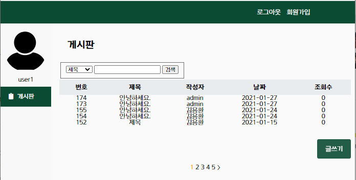
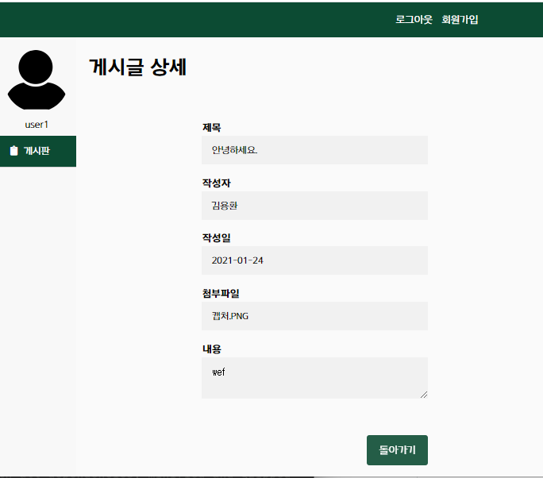
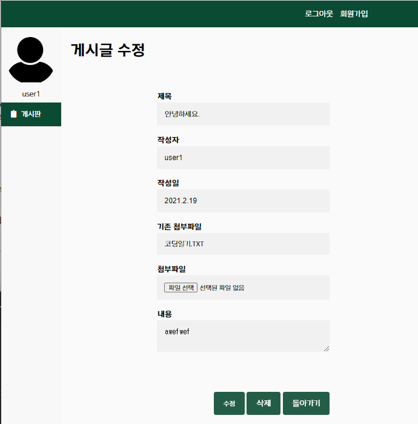
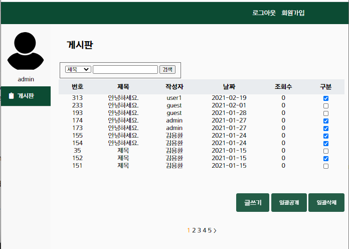
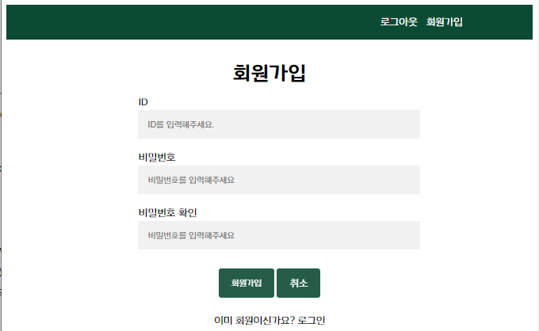

# PostService
PostService는 게시글을 작성하여 글 또는 첨부파일을 저장할 수 있는 서비스입니다.
회원가입과 로그인 기능을 통하여 게시글을 작성할 수 있습니다.

# Visuals
일반 사용자들이 이용하는 게시판입니다.

아래 화면은 게시글 클릭 시 자세한 내용을 볼 수 있는 화면입니다.

아래 화면은 일반 사용자가 게시글을 수정하는 화면입니다.
단, 수정 기능은 자기글만 수정할 수 있습니다.

아래 화면은 관리자 페이지입니다.
관리자 역할로써 게시글을 일반 사용자들에게 공개하거나 게시글을 삭제할 수 있습니다.
단, 게시글을 수정할 수 없습니다.

아래 화면은 회원가입 화면입니다.

